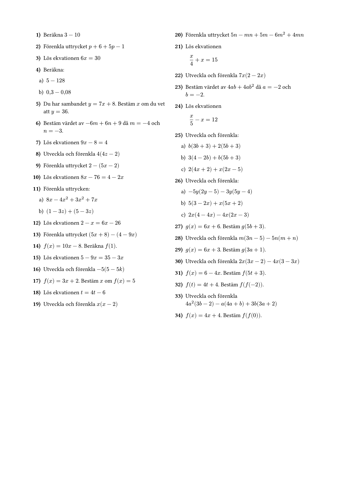
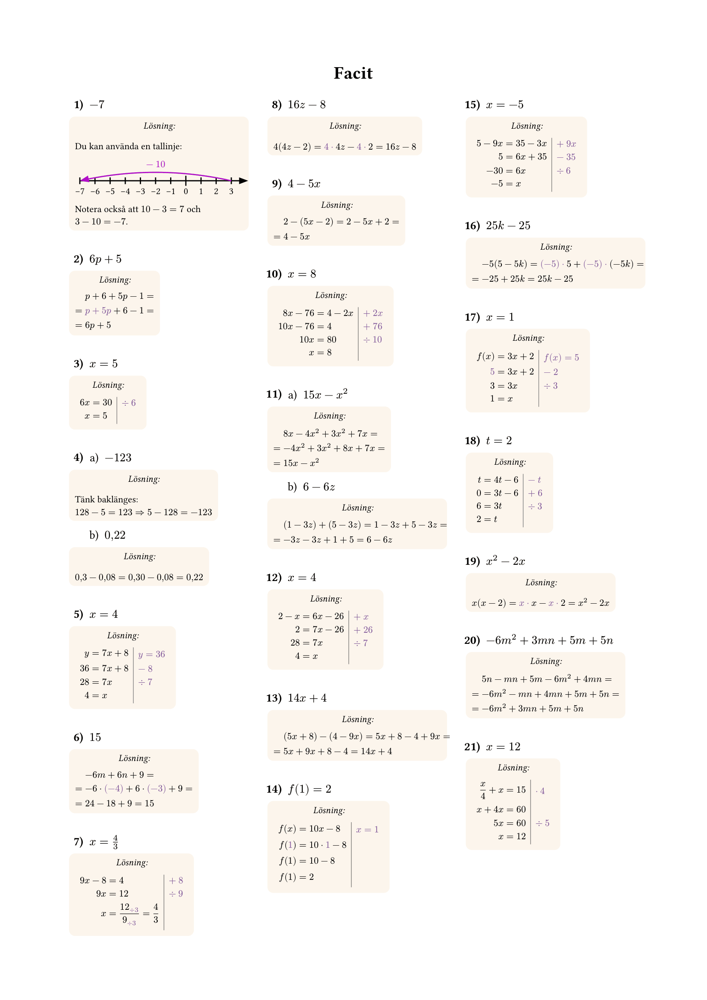

# stencil - The math problem sheet generator
Generate math problems programmatically and turn them into a problem sheet (swedish: _stencil_).  
Served as a website at [stencil.nu](https://www.stencil.nu/).

## Example

  
  

## Features
- Generate human-designed solutions for every problem
- Control the layout of the stencil, including titles, spacing for handwriting, and more!
- Opinionated selecting and spreading of problems to ensure a smooth difficulty curve with spaced repetition
- Difficulty of problems are tuned to the Swedish grading system
- B.Y.O.DB: While all problems are written in the source code, they can be arbitrarily divided into courses, chapters and topics with your own Postgres database
- Custom web editor for easier DB modificiations

Built using Rust, Svelte and Postgres. PDFs are generated using [Typst](https://github.com/typst/typst).
